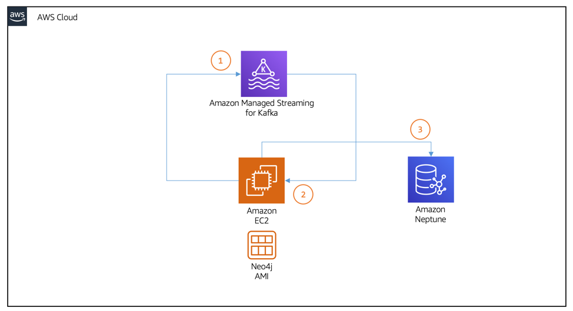

# streaming-neo4j-msk-neptune

Docker images

- neo4j (producer)
- gremlin (front-end)
- consumer (kafka consumer and neptune publisher)
- config service (get and post infra resource urls)

Infra setup steps

- run the cdk app to set up infrastructure using npm run deploy
  - publish output of the cdk app to
  - launch and feed the config service using the output of the cdk app
  - launch the remaining docker containers pulling data from the config service
