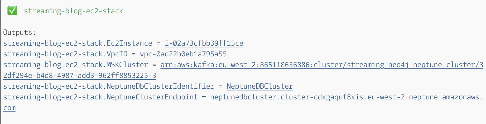

# Architecture


# Prerequisites

# Launching the app

To setup the app, run the following commands:

## Download code from GitHub

```
git clone https://github.com/sahays/streaming-neo4j-msk-neptune
cd streaming-neo4j-msk-neptune/bootstrapper
```

## Review configuration file

Before launching the app, observe and make changes to `cdk.json` file inside
`streaming-neo4j-msk-neptune/bootstrapper`. You need to provide an Amazon EC2
key-value pair name replacing the placeholder text `<your-ec2-key-pair-name>`

```
{
  "app": "node bin/bootstrapper.js",
  "context": {
    "vpc_cidr": "192.168.0.0/16",
    "ec2_class": "t3a",
    "ec2_type": "xlarge",
    "ec2_key_pair": "<your-ec2-key-pair-name>",
    "sg_fromIp": "0.0.0.0/0"
  }
}
```

## Deploy

After making changing to the file, run the following commands to launch:

```
npm install
npm run deploy
```

After successful run of the program (it takes about 10 minutes to complete),
you'll see an output similar to the following:


| Variable                    | Purpose                                        |
| --------------------------- | ---------------------------------------------- |
| .VpcID                      | Amazon VPC Id that contains all the resources  |
| .MSKCluster                 | Amazon Managed Service for Kafka cluster ARN   |
| .EC2Instance                | Amazon EC2 instance Id                         |
| .NeptuneDbClusterIdentifier | Cluster name for the Amazon Neptune DB cluster |
| .NeptuneClusterEndpoint     | Endpoint of the Amazon Neptune DB cluster      |

## Detailed architecture


## Post deploy steps

SSH into the Amazon EC2 instances created by the app. To see a list of all
running containers run the following command:

```
docker container ls -a
```

You should be able to see the following 3 docker container services:

| Service name           | Purpose                                                                                      |
| ---------------------- | -------------------------------------------------------------------------------------------- |
| transformation-service | runs the transformation engine that transforms Neo4j data to Amazon Neptune data format      |
| neo4j-service          | runs the Neo4j graph database version 3.5.6                                                  |
| startup-service        | runs the startup docker that fetches endpoint information from Amazon Neptune and Amazon MSK |
| kafka-topic-service    | creates a new topic in Amazon MSK                                                            |

If you want to see logs for a service, run the following command:

```
docker container logs <service-name>
```

## Execute cypher scripts

To execute cypher scripts you need to enter the `neo4j-service` container using
the following command

```
docker container exec -it neo4j-service cypher-shell
```

then execute a simple create command like the following

```
CREATE (TheMatrix:Movie {title:'The Matrix', released:1999, tagline:'Welcome to the Real World'});
CREATE (Keanu:Person {name:'Keanu Reeves', born:1964});
CREATE (Keanu)-[:ACTED_IN {roles:['Neo']}]->(TheMatrix);
```

Next, see the `transformation-service` logs by executing

```
docker container logs transformation-service
```

you should see an output similar to the following:

```
processing node {
  id: '0',
  before: null,
  after: {
    properties: {
      tagline: 'Welcome to the Real World',
      title: 'The Matrix',
      released: 1999
    },
    labels: [ 'Movie' ]
  },
  type: 'node'
}
inserted 0 {
  properties: {
    tagline: 'Welcome to the Real World',
    title: 'The Matrix',
    released: 1999
  },
  labels: [ 'Movie' ]
}
Movie
processing node {
  id: '20',
  before: null,
  after: {
    properties: { born: 1964, name: 'Keanu Reeves' },
    labels: [ 'Person' ]
  },
  type: 'node'
}
inserted 20 {
  properties: { born: 1964, name: 'Keanu Reeves' },
  labels: [ 'Person' ]
}
Person
```

Finally, to confirm that Amazon Neptune has been updated with streaming data run
the following commands in order

```
docker run -it -e NEPTUNE_HOST --entrypoint /replace-host.sh sanjeets/neptune-gremlinc-345
```

```
:remote console
```

```
g.V().count()
```

## Query architecture


# Cleaning up

To cleanup AWS resources you need to run the following command:

```
npm run destroy
```
